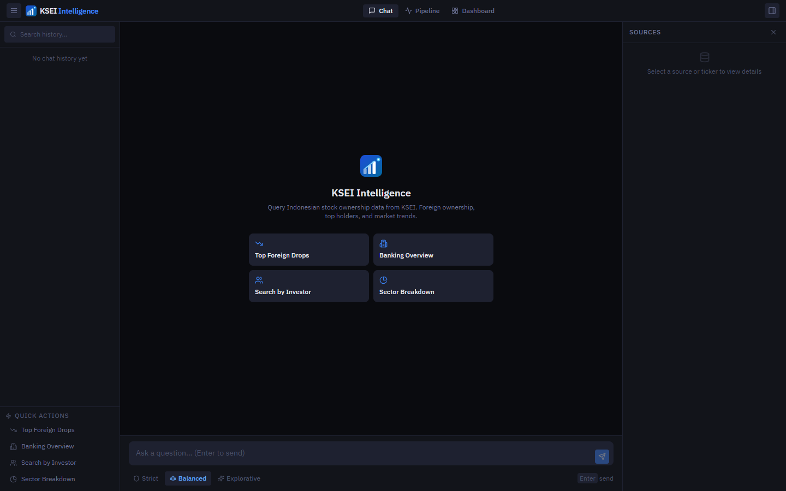
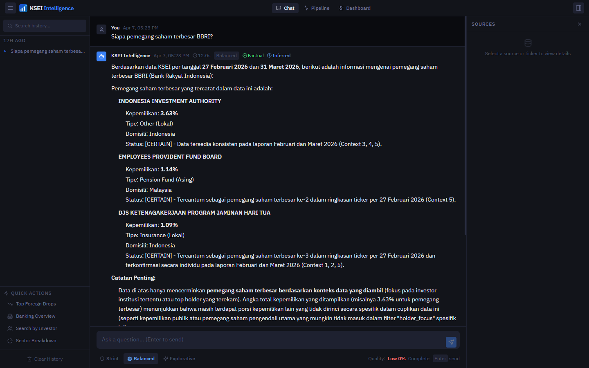

# KSEI Intelligence

A RAG (Retrieval-Augmented Generation) system for querying Indonesian stock ownership data from KSEI (Kustodian Sentral Efek Indonesia). Ask questions in natural language — Indonesian or English — and get answers grounded in real data with source citations.

**The core idea:** instead of sending your entire dataset to an LLM (expensive, slow, context-limited), we pre-process everything into a local vector database. When you ask a question, only the most relevant chunks are retrieved and sent to the LLM — keeping answers fast, accurate, and grounded in actual data.

### Data sources

**KSEI PDF reports** — monthly ownership reports published by KSEI, extracted page-by-page using `pdfplumber` and chunked into 800-character overlapping segments. These contain the authoritative ownership percentages, holder names, and domicile information.

**KSEI JSON data** — structured ownership records parsed into two chunk types: `ticker_summary` (aggregated foreign/local split per stock) and `holder_focus` (one chunk per significant holder above 1%, enabling investor-specific queries).

**Live market data API** — at query time, real-time data (foreign net flow, price performance across 1W/1M/3M/YTD/1Y periods, corporate actions) is fetched and injected directly into the LLM prompt alongside the retrieved context. This enrichment is optional — the system works without it.

### Why local embeddings and a vector database

Text is converted into 384-dimensional numerical vectors using `sentence-transformers/all-MiniLM-L6-v2`, a model that runs entirely on CPU with no API calls or internet required. Vectors are stored in ChromaDB, a local persistent vector database.

This approach means:
- **No dependency on an external embedding API** — ingestion and search work offline
- **Semantic search, not keyword search** — "who owns the most shares in BBCA" matches chunks that say "largest shareholder" or "kepemilikan terbesar" even without exact word overlap
- **Privacy** — your data never leaves your machine during the retrieval step; only the retrieved chunks (not the full database) are sent to the LLM
- **Metadata filtering** — ChromaDB allows filtering by ticker, date, or source type before doing the vector search, combining precision with semantic flexibility

---

## Screenshots

**Empty state — quick action cards**



**Response with source citations and confidence markers**



---

## How It Works

```
User question
    │
    ├── ChromaDB semantic search  (local vector DB)
    ├── Live market data fetch    (optional enrichment)
    │
    └── LLM prompt assembly
            │
            └── Answer + sources + quality score
```

Data is ingested from KSEI JSON files and PDF reports into ChromaDB as vector embeddings. On each query, relevant chunks are retrieved and passed to an LLM along with optional live market data enrichment injected directly into the prompt.

Three response modes control LLM behavior:

| Mode | Behavior |
|------|----------|
| **Strict** | Only retrieved data, no inference |
| **Balanced** | Data + light reasoning, marks inferences |
| **Explorative** | Broader analysis with confidence markers |

---

## Stack

**Backend** — Python, FastAPI, ChromaDB, sentence-transformers (`all-MiniLM-L6-v2`), pdfplumber

**LLM** — Cloud LLM API (primary) · Ollama local model (fallback)

**Frontend** — React 19, TypeScript, Vite, Tailwind CSS, Zustand

---

## Setup

```bash
git clone https://github.com/Yarizk/vectoring.git
cd vectoring

# Configure
cp .env.example .env
# Set LLM_PROVIDER, API key, and optional market data token

# Install
pip install -r requirements.txt
cd frontend && npm install && cd ..

# Ingest data (place files in archive/ and raw_data/ first)
cd src && python ingest_json.py && python ingest_pdf.py && cd ..

# Run
cd src && python api.py          # API on :8000
cd frontend && npm run dev       # UI on :5173 (proxies to :8000)
```

Or with Docker:

```bash
docker-compose up -d
# Open http://localhost:8000
```

---

## API

| Method | Endpoint | Description |
|--------|----------|-------------|
| `POST` | `/ask` | Query with RAG |
| `GET` | `/stats` | DB stats |
| `GET` | `/health` | Health check |
| `POST` | `/ingest` | Trigger ingestion |

Example:

```bash
curl -X POST http://localhost:8000/ask \
  -H "Content-Type: application/json" \
  -d '{"question": "Siapa pemegang saham terbesar BBCA?", "mode": "balanced"}'
```

---

## Environment Variables

| Variable | Default | Description |
|----------|---------|-------------|
| `LLM_PROVIDER` | `jatevo` | `jatevo` or `ollama` |
| `JATEVO_API_KEY` | — | API key for cloud LLM |
| `OLLAMA_MODEL` | `qwen2.5:7b` | Local model name |
| `CHROMA_DB_PATH` | `./chroma_db` | Vector DB path |
| `MARKET_DATA_TOKEN` | — | Optional live market enrichment |

---

## What's Next

- [ ] Streaming responses (SSE)
- [ ] Date-range query filters
- [ ] Scheduled auto-ingestion
- [ ] Real-time price data via WebSocket
- [ ] Ownership trend charts inline in responses
- [ ] Export conversation as PDF

---

## License

MIT
